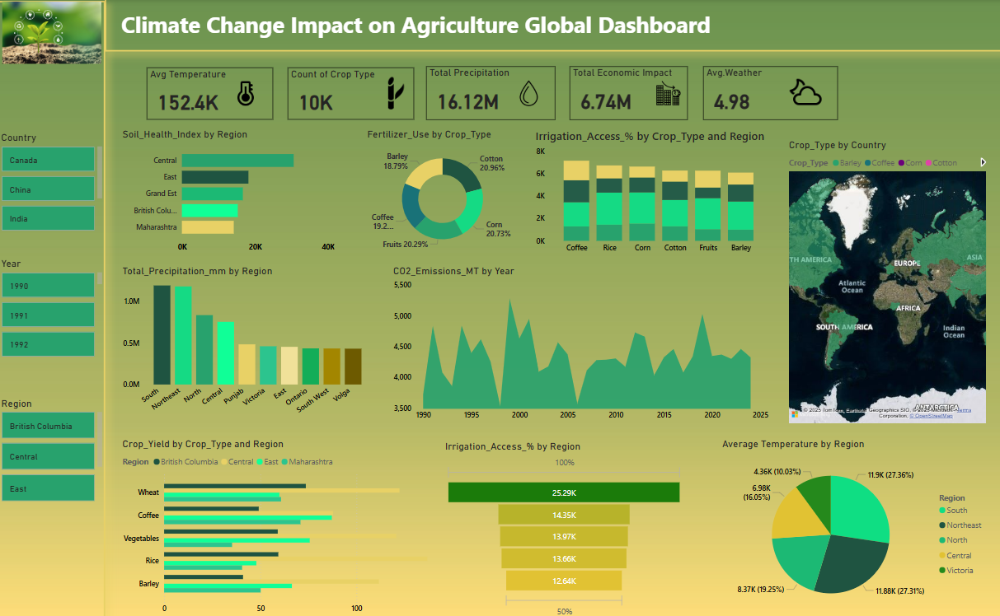

 # Climate Change Impact on Agriculture - Power BI Dashboard

This repository contains an interactive **Power BI Dashboard** that visualizes and analyzes the global impact of **climate change on agriculture**. The dashboard uses multi-dimensional data to present trends and patterns across various regions and crop types.

---

# Key Metrics

- Average Temperature:** 152.4K (indicative scale)
- Crop Types Covered:** 10,000+
- Total Precipitation:** 16.12 Million mm
- Total Economic Impact:** $6.74 Million
- Average Weather Index:** 4.98

---

# Dashboard Features

- Soil Health Index by Region**
- Fertilizer Use by Crop Type** (Barley, Cotton, Corn, Coffee, Fruits)
- Irrigation Access % by Crop and Region**
- Crop Yield Comparison** (Wheat, Coffee, Vegetables, Rice, Barley)
- Total Precipitation by Region**
- CO₂ Emissions Over Time** (1990–2025)
- Average Temperature by Region**
- Interactive Geo-Map**: Crop Types by Country

---

# Covered Regions and Countries

- Countries:** India, Canada, China
- Regions:** British Columbia, Central, East, Maharashtra, South, North, Punjab, Victoria, etc.

---

# Tools & Technologies

- Power BI** – for interactive data visualization
- DAX – for calculated fields and measures
- Power Query** – for data transformation
- Map Visuals – for geographic crop type insights

---

# Project Purpose

To understand the complex relationship between **climate change indicators** (temperature, precipitation, CO₂ emissions) and **agricultural productivity**, including:

- Crop yield
- Soil health
- Irrigation access
- Economic impact

This analysis can support **policy makers, researchers, and environmental analysts** in making data-driven decisions.

---

# Learning Outcomes

- Hands-on practice with Power BI visuals and dashboards
- Application of data modeling and advanced visuals
- Understanding of climate-agriculture interactions through data

---

# Dataset Info

The dataset used simulates real-world data on the **impact of climate change on agriculture**, collected across years (1990 to 2025), crop types, and regions.

---

# Dashboard Preview

---

# Contributions

Contributions, suggestions, or feedback are welcome! Feel free to fork the repository and create pull requests.

---

# License

This project is for educational and research purposes only.

